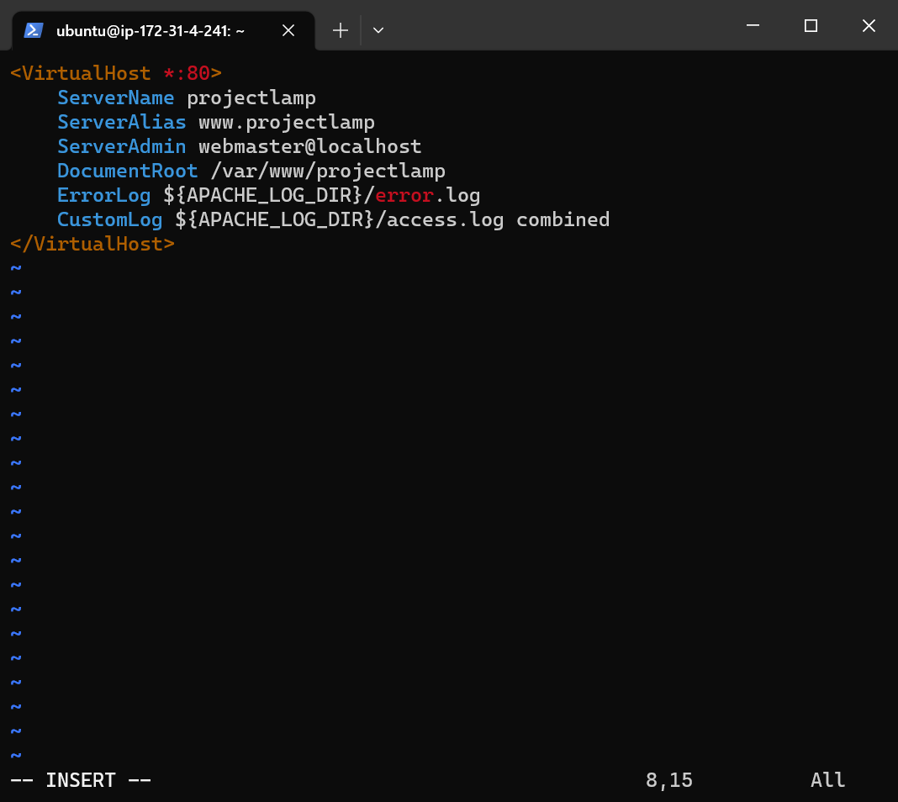
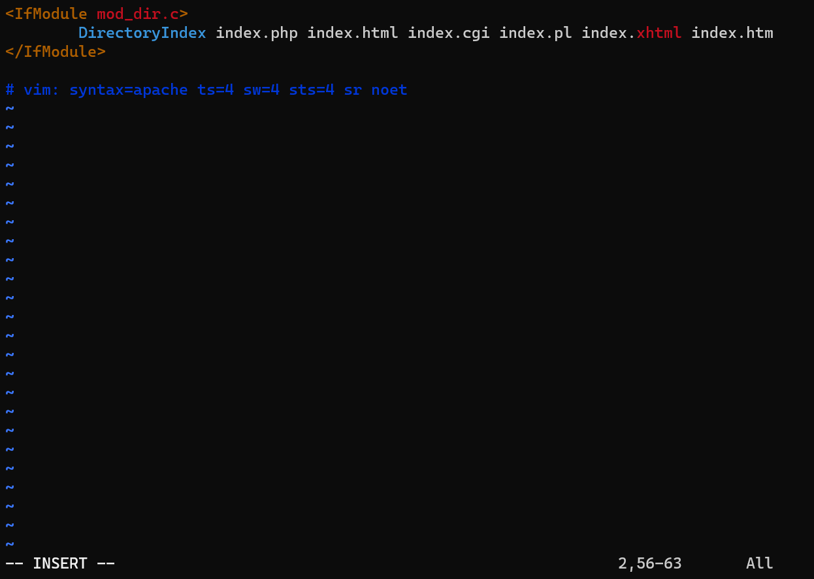

# Deploying a LAMP Stack Web Application on AWS Cloud

A LAMP Stack is a solution stack that is being used in deploying web applications. It stands for Linux, Apache, MySql and php,perl or python.

This project focusses on the LAMP Stack which entails:

Linux: this is an operating system which serves as the backbone of the LAMP Stack, and it is actively used in deploying other components.

Apache: is a web server software which via HTTP requests processes requests and transmits information via the internet.

MySQL: use for creating and maintaining dynamic databases. It supports SQL and relational tables and provides a DBMS(Database Management System).

PHP,PERL or PYTHON: this represents programming languages which effectively combines all the elements of the LAMP stack and is used to make web applications execute.

## Creation of EC2 Instance
First we log on to AWS Cloud Services and create an EC2 Ubuntu VM instance. When creating an instance, choose keypair authentication and download private key(*.pem) on your local computer.

 
On windows terminal `cd`nto the directory containing the downloaded private key.Run the below command to log into the instance via ssh:

`ssh -i <private_keyfile.pem> username@ip-address`

 

## Installing Apache Web Server
To deploy the web application, we need to install apache via ubuntu package manager #update packages using `sudo apt update` and `sudo apt install apache2`

 

To verify that apache is running correctly we run the command `sudo systemctl status apache2` 

## Configuring Security Group Inbound Rules on EC2 Instance
A Security group is a group of rules that acts as a virtual firewall to the type of traffic that enters (inbound traffic) or leaves (outbound traffic) an instance.

When the instance is created, we have a default TCP rule on port 22 opened which is useful for SSH connection to a terminal. In order to ensure that our webpage are being acccessed on the internet, we need to open a TCP port 80 inbound rule.

)

To check the accessiblity of our web server on the internet, we `curl` the IP address/DNS name of our localhost. as shown below 

To see if our web application server can respond to requests , use the public ip address of our instance on a web browser. http://<Public-IP-Address>:80

## Installing MySQL
We use MySQL as a relational database to store and manage data on our site.

Install mysql using the `sudo apt install mysql-server` command.

On successful secure configuration, `sudo mysql` on the terminal to have access to the MySQL DB.

Exit from the MySQL terminal by typing `exit`.

## Installing PHP (Python)

PHP serves as a programming language which is useful for dynamically displaying contents of the webpage to users who make requests to the webserver.

We need to install php alongside its modules, php-mysql which is php module that allows php to communicate with the mysql database, libapache2-mod-php which ensures that the apache web server handles the php contents properly using `sudo apt install php php-mysql libapache2-mod-php` command as shown below

 
On successfull installation of php we can confirm the version to see if it was properly installed.

## Enabling PHP on the Website

With the default directory setting on Apache, a file named `index.html` will always take precedence over an `index.php` file. On this project we need to create a new directory called projectlamp inside the /var/www/ directory using `sudo mkdir /var/www/projectlamp` then we change permissions of the projectlamp directory to the current user system using `sudo chown -R $USER:$USER /var/www/projectlamp` command 

The projectlamp directory represents the directory which will contains files related to our website as it represents a new server block on the apache webserver. In order to spin up this server block we need to configure it by creating a .conf file using `sudo vi /etc/apache2/sites-available/projectlamp.conf` command as shown below

We then run `sudo a2ensite projectlamp` to activate our server block, run `sudo a2dissite 000-default` to deactivate the default webserver block that comes with apache on default and finally reload the apache2 server using `sudo systemctl reload apache2` as shown below 

To change the behavior of the website, we'll need to edit the **/etc/apache2/mods-enabled/dir.conf** file and change the order in which the **index.php** file is listed within the *DirectoryIndex** directive using the command `sudo vim /etc/apache2/mods-enabled/dir.conf`  

Run the sudo systemctl reload apache2 to restart the apache2 web server for the changes made to the DirectoryIndex to take effect. Exit this page by entering `<esc+wq!>`

Now that we have a custome location to host our website's files and folders, we'll create a PHP test script to confirm that Apache is able to handle and process requests for PHP files using the command `sudo $ vim /var/www/projectlamp/index.php` to open a blank file.

 
This will open a blank file, add the following text `<?php
phpinfo();` which is a valid PHP code inside the file. Save and exit the file by entering <esc+wq!>.

Refresh the public IP of the ec2 instance to see a page that provides information about our server from the perspective of PHP. it is useful for debugging and to ensure that our settings are being applied correctly.

 

